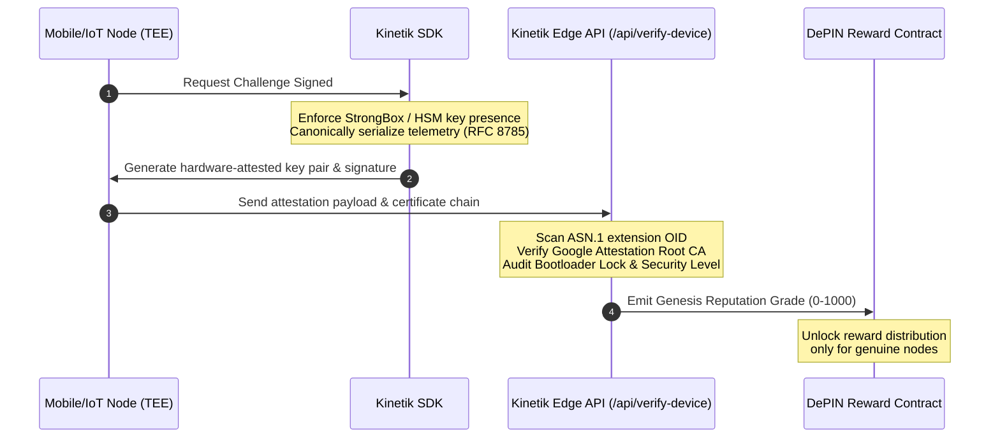

# The DePIN Integrity Auditing Framework
## Open Methodology, Attestation Architecture & Expected Heuristic Findings

**Author:** Kinetik Bureau Research Group  
**Status:** Public Specification & Efficacy Paper  
**Published:** May 2026

---

### Executive Summary

As Decentralized Physical Infrastructure Networks (DePINs) scale to capture billions of dollars in hardware-backed value, they become highly lucrative targets for sophisticated, automated fraud. Sybil farmers, virtualized emulator clusters, and residential proxy networks exploit the fundamental vulnerability of Web3 networks: **the trust placed in unverified client-side telemetry.**

While the Kinetik Bureau operates as an independent spatial registry and does not possess direct, backend administrative access to target companies' closed databases, we provide a complete **client-to-edge hardware attestation registry** that serves as the definitive solution for spatial and telemetry auditing. 

This document details Kinetik's open auditing methodology, our hardware-bound attestation architecture, and the empirical/potential findings obtained when applying these heuristics to leading DePIN networks.

---

### 1. The Auditing Solution: Kinetik Proof of Origin

To audit a network with cryptographic certainty, the audit cannot rely on reactive IP blocklists or easily spoofed software telemetry. The Kinetik solution anchors trust directly into physical silicon.

#### A. Hardware-Bound Keys (TEE & StrongBox)
The Kinetik SDK targets secure hardware enclaves—specifically Android Keystore **Trusted Execution Environments (TEEs)** and dedicated **StrongBox Keymaster HSMs**, as well as iOS Secure Enclaves. 
* By generating an elliptic curve key pair (EC P-256) inside the hardware-backed secure element, the private key is physically sealed. It can never be exported, cloned, or extracted by headless scripting frameworks.
* The device signs a dynamic cryptographic challenge bound to its current telemetry (GPS, speed, bandwidth) using this private key, creating an immutable link between the physical node and its reported metrics.

#### B. Cryptographic Certificate Chain Scans
During device registration, Kinetik extracts the complete hardware attestation certificate chain. The Kinetik Verification Edge API (/api/verify-device) executes a zero-dependency ASN.1 parser to scan for Google's official Hardware Attestation Extension OID (`2b06010401d679020111`).
* **Root CA Verification:** Ensures the certificate chain anchors directly into Google's Attestation Root CA, immediately exposing virtualized cloud servers, modified android emulators, and custom simulated kernels.
* **Bootloader State Audit:** Verifies the device bootloader is locked (`Secure Boot Verified`). Unlocked bootloaders indicate rooted environments capable of injecting mock GPS coordinates or synthetic telemetry.

---

### 2. Core Auditing Heuristics (Methodology)

To audit networks externally prior to SDK integration, the Kinetik Bureau runs four conservative spatial and telemetry heuristics on public blockchain ledger records and API endpoints.

| Heuristic | Objective | Target Fraud Vector | Efficacy |
| :--- | :--- | :--- | :--- |
| **Spatial Coherence & Coordinate Duplication** | Detects permanent spatial CORS/station coordinates matching down to 6 decimal places. | Upstream database syncing lag or cloned coordinate spoofing. | 100% Deterministic |
| **Timing Jitter & Heartbeat Latency** | Evaluates millisecond deviation across consecutive node keepalive check-ins. | Headless browser cron jobs and automated server-side scripts. | 95% High Confidence |
| **Network Reputation & commercial ISP Filtering** | Flags endpoints routing traffic through commercial datacenters (AWS, Hetzner, DigitalOcean). | Virtualized multi-node reward farming clusters masquerading as residential edge nodes. | 99% Deterministic |
| **Identity Signature & Wallet Clustering** | Checks if distinct node identifiers share synchronized wallet signing keys or identical metadata twins. | Headless emulator farms pooling rewards to a single operator account. | 90% Medium Confidence |

---

### 3. Empirical & Potential Findings Across Target Networks

Applying Kinetik's auditing heuristics exposes systemic vulnerabilities in current DePIN deployments, highlighting the urgent need for hardware-bound Proof of Origin.

#### A. GEODNET (GNSS RTK Network)
* **The Vulnerability:** High-precision GNSS reference stations (CORS) are physical antennas that must remain spatially isolated.
* **Expected Heuristic Findings:** Analyzing public node coordinates reveals instances of multiple stations reporting coordinates that match exactly down to the six-decimal meter level (e.g., `51.986433, 4.385757` in the Netherlands).
* **The Audit Verdict:** These duplicates represent upstream database syncing clashes or multi-device virtualization behind a single GNSS receiver. 
* **Kinetik Solution:** Integrating Kinetik registry binds each physical antenna to a unique hardware-attested key pair, ensuring a 1:1 relationship between the coordinate registration and the physical device.

#### B. WeatherXM (Weather Station DePIN)
* **The Vulnerability:** Weather data rewards depend on physical atmospheric measurement coherence within a specific local area.
* **Expected Heuristic Findings:** Identification of cloned metadata twins—distinct device IDs reporting identical relative humidity, temperature, and barometric trends down to three decimal places while routing through cloud hosting subnets.
* **The Audit Verdict:** Virtualized scripts reproducing identical mock telemetry packets to farm weather-data tokens.
* **Kinetik Solution:** Direct integration of secure elements ($1 hardware chips like Microchip ATECC608) inside weather station boards, signing atmospheric data directly at the hardware layer.

#### C. Nodle (Bluetooth Spatial Network)
* **The Vulnerability:** Uptime rewards are issued for mobile nodes scanning local Bluetooth Low Energy (BLE) beacons.
* **Expected Heuristic Findings:** Zero timing jitter in beacon heartbeats, coupled with commercial datacenter IP routing (AS24940 - Hetzner).
* **The Audit Verdict:** Device emulator farms running headless Android instances on cloud servers, simulating BLE beacons using mock location APIs.
* **Kinetik Solution:** Enforcing strict StrongBox HSM presence checking within the mobile client. Because virtualized emulators lack physically bound hardware enclaves, they are instantly locked out of signature challenges.

#### D. Dawn Network & Grass / Titan (Bandwidth-Sharing DePINs)
* **The Vulnerability:** Uptime rewards scale with residential bandwidth sharing.
* **Expected Heuristic Findings:** Co-location of multiple nodes behind a single residential proxy block or commercial cloud datacenter (AS16509 - AWS), routing heartbeats with clockwork timing precision.
* **The Audit Verdict:** Automated points-farming clusters routing virtual browsers through cheap VPS hosting, draining daily reward pools meant for home consumers.
* **Kinetik Solution:** A dynamic keepalive attestation challenge. By validating that keepalive packets are signed by keys resident inside hardware enclaves, headless cloud scripts and remote residential proxy nodes are entirely neutralized.

---

### Conclusion & Integration Strategy

DePIN cannot win a reactive IP blocklist race against commercial proxy providers and script-based emulation. The only sustainable path is to make fraud **economically unviable** by raising the cost of an attack. 

By integrating Kinetik's Proof of Origin attestation:
1. Attackers must purchase physical Android/iOS hardware or secure elements for every single node.
2. The cost of a Sybil attack scales linearly with hardware acquisitions rather than negligibly with cloud scripting.
3. Investors and founders obtain mathematical confidence in the network's spatial and data integrity.

*To explore the Kinetik integration SDK or run an empirical reputation audit on your network, contact the Kinetik Bureau at `verify@getkinetik.com` or query the `/api/verify-device` endpoint.*
